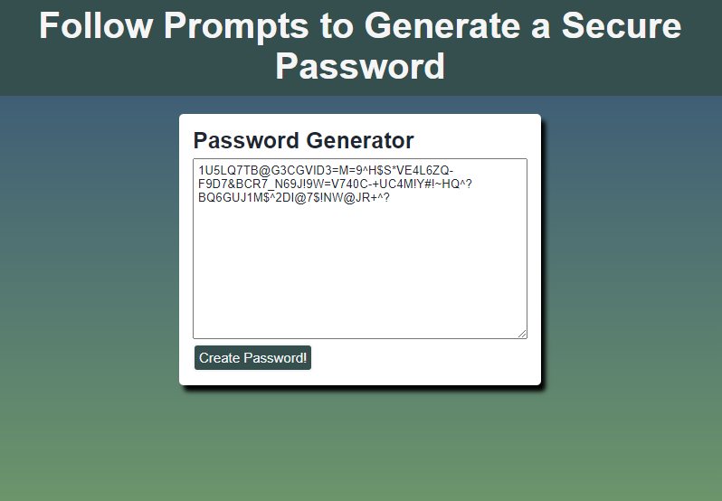

#Customizable Password Generator

## Description
 The purpose of this project is to allow users to custom-generate a secure password using webpage prompts. The intended goal of the project is that the user, initially only presented with the option to click a button to generate a password, is upon clicking the button presented with a series of prompts that allow them to choose among several character sets to use for their password, as well as their desired password length. Their customized password will then be generated and displayed on the webpage.

 The intended effect of this project is to impress upon both the user and developer the inventive ways in which JavaScript can be used to allow users to interact with webpages.

## Usage
To generate a password, first press the button labeled "Generate Password!" found on the main webpage. 
.

The user will then be prompted to enter a desired password length between 8 and 128 characters. If the length entered is outside of those parameters, then an alert will be displayed and they will be given another chance to enter a value of 8-128 characters.
.

The user will then be directed to a series of "confirm" prompts that give them the option of including 1-4 sets of characters. These sets are lowercase English letters, uppercase English letters, numbers, and special characters. If they do not choose at least one set, they will be shown an alert and then be given another chance to choose their sets.
.

After the sets have all been chosen, the customized password will be displayed on the webpage's textarea. If a user wants to generate another password, they can simply click "Generate Password!" again.
.

## License
This project is available under the MIT license. See the LICENSE file for more info.

## Credits
The source code for this project is available at: https://github.com/coding-boot-camp/friendly-parakeet

A tutorial followed to complete the object was used. It is available at: https://dev.to/code_mystery/random-password-generator-using-javascript-6a

## Webpage
The project is located at: https://cbailey73.github.io/password-generator/

